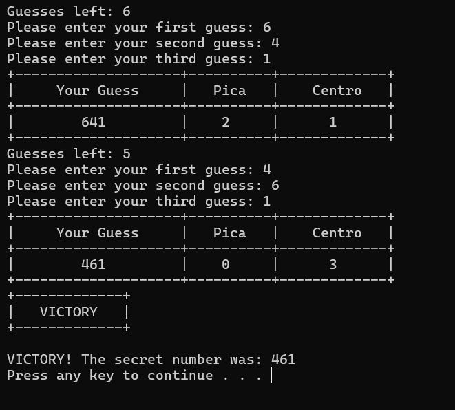

# Pica Centro

## Overview
**Pica Centro** is a simple number-guessing puzzle game built to be a two-player game that allows players to utilize their problem-solving skills.

## Features
- Takes in user inputs for the actual number. Then, takes in player two's guesses for a total of ten guesses.
- An algorithm that checks if the inputted numbers are in the correct place (centro), and if they're not, checks if they are in the number at all (pica).
- [Feature 3, e.g., "Mobile-friendly UI"]

## Why I Built It
I built Pica Centro to explore my capabilities in Python. I made this right after learning the basics, and it was a fun project where I had to use what I've learned and test myself. It also reflects my interest in coding, as I have always wanted to make games. While this is not very impressive, it is a major step in my career as a programmer and in tech as this is my first real project completed by myself (no AI or tutorials, just my own knowledge).

## Screenshots

## Future Improvements
- For now, this project is complete, but as I learn more, I may make another one with much better UI. We'll see where this goes.

